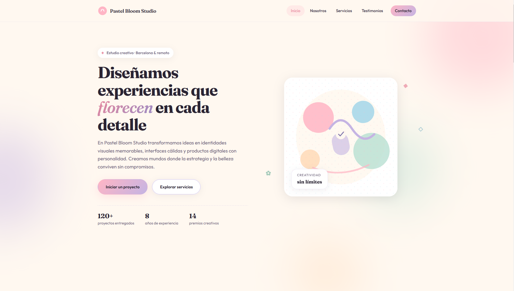
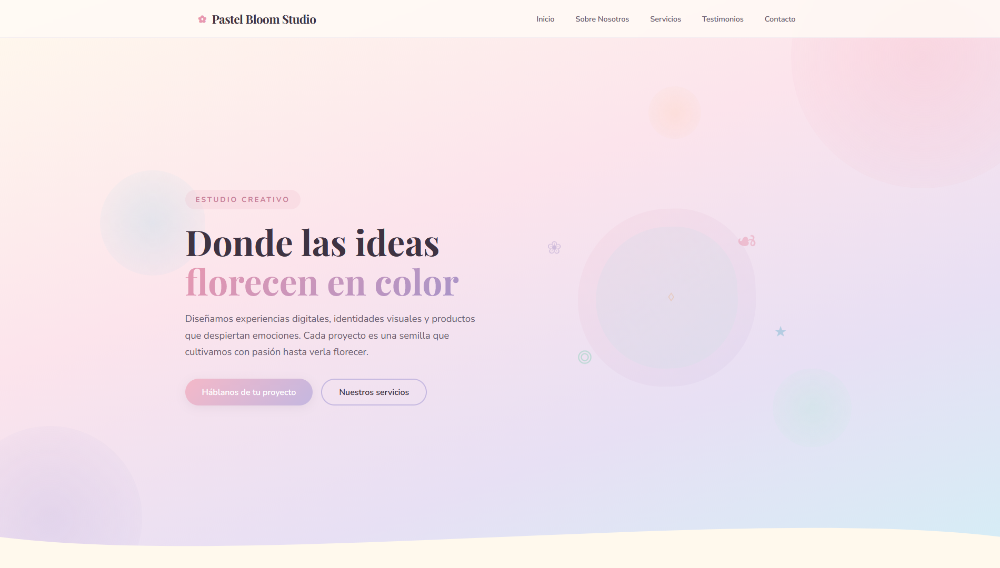

# PFO2 — Prompt Engineering en Agentes de IA

## Datos del estudiante

| Campo | Detalle |
|---|---|
| Nombre | Ivanna Agostina Verdejo de Rodt |
| Carrera | Tecnicatura Superior en Desarrollo de Software a Distancia |
| Materia | Desarrollo Front-End |
| Trabajo | PFO N° 2 — Prompt Engineering en Agentes de IA |

---

## Deploy unificado

🔗 **[Ver proyecto en Vercel](https://pfo-2-nu.vercel.app/)**

---

## Prompt utilizado

```
Actúa como un desarrollador frontend senior especializado en diseño web moderno, accesibilidad y experiencia de
usuario. Tu tarea es generar de manera autónoma una Landing Page completa y lista para ejecutarse, tomando todas
las decisiones técnicas necesarias sin requerir aclaraciones posteriores.

## Objetivo del proyecto

Desarrollar una Landing Page para una marca ficticia llamada "Pastel Bloom Studio", un estudio creativo
dedicado al diseño de experiencias, identidad visual y productos digitales. El objetivo es transmitir una
personalidad alegre, creativa y sofisticada a través de una estética **pastel maximalista**.

## Restricciones importantes

* No solicites información adicional ni hagas preguntas.
* Completa cualquier detalle faltante tomando decisiones coherentes con el concepto general.
* Genera todos los archivos y recursos necesarios para que el proyecto funcione correctamente.
* El resultado debe estar listo para ejecutarse sin requerir modificaciones manuales posteriores.
* Prioriza la calidad visual, la organización del código y la experiencia del usuario.
* Utiliza contenido ficticio original.
* No utilices texto de relleno como "Lorem Ipsum".
* No incluyas funcionalidades backend reales.
* Ninguna de las secciones obligatorias puede omitirse, fusionarse ni reemplazarse por otros componentes
equivalentes.
* Si alguna decisión de diseño entra en conflicto con los requisitos funcionales, los requisitos funcionales
tendrán
prioridad.

## Naturaleza de la Landing Page

* Genera una única Landing Page de una sola página (single-page application visual).
* Todas las secciones obligatorias deben formar parte del mismo sitio.
* El menú de navegación debe utilizar enlaces internos (anclas) que permitan desplazarse hacia cada sección
correspondiente.
* No generes múltiples páginas independientes para representar las distintas secciones de la Landing.

## Tecnologías

* Utiliza HTML, CSS y JavaScript.
* Evita dependencias innecesarias.
* El proyecto debe ser fácilmente desplegable en Vercel.

## Estilo visual

La identidad visual debe inspirarse en una estética **pastel maximalista**, caracterizada por:

* Paleta de colores suaves y alegres.
* Combinaciones de rosa, lavanda, celeste, crema, durazno y verde menta.
* Diseño abundante en detalles decorativos sin sacrificar legibilidad.
* Elementos gráficos orgánicos.
* Formas redondeadas.
* Capas visuales.
* Patrones sutiles.
* Ilustraciones o íconos decorativos.
* Sombras suaves.
* Sensación lúdica, acogedora y creativa.
* Apariencia contemporánea y elegante, evitando un resultado infantil.

La Landing Page debe destacar visualmente y transmitir una identidad fuerte y memorable. Debe sentirse como el sitio
profesional de un estudio creativo real, con una ejecución cuidada y una estética distintiva.

## Diseño responsive

Implementa un diseño completamente responsive.

Debe adaptarse correctamente a:

* Computadoras de escritorio.
* Tablets.
* Dispositivos móviles.

La experiencia móvil debe recibir la misma atención y nivel de detalle que la versión de escritorio.

## Accesibilidad y experiencia de usuario

* Mantén buen contraste entre textos y fondos.
* Usa etiquetas semánticas apropiadas.
* Incluye textos alternativos descriptivos en imágenes decorativas relevantes.
* Implementa estados hover y focus visibles.
* Prioriza la legibilidad y la navegación intuitiva.
* Asegúrate de que botones, enlaces y formularios sean fáciles de utilizar en pantallas táctiles.

## Estructura obligatoria

La Landing Page debe incluir obligatoriamente todas las siguientes secciones.

### 1. Header

Debe contener:

* Logo textual con el nombre "Pastel Bloom Studio".
* Menú de navegación funcional mediante anclas internas.
* Diseño atractivo y coherente con la estética pastel maximalista.

### 2. Hero Section

Debe incluir:

* Un título principal impactante.
* Un subtítulo descriptivo y persuasivo.
* Un botón principal de llamada a la acción (CTA).
* Un botón secundario opcional.
* Elementos visuales decorativos relacionados con la identidad del sitio.

### 3. Sobre Nosotros

Debe presentar:

* La historia o presentación de la marca ficticia.
* Su propuesta de valor.
* Una descripción clara de qué la diferencia.
* Texto original y persuasivo.

### 4. Servicios o características principales

Presenta al menos cuatro servicios. Cada uno debe incluir:

* Título.
* Descripción.
* Ícono o recurso visual.

Los servicios pueden abarcar áreas como:

* Branding.
* Diseño UX/UI.
* Desarrollo de experiencias digitales.
* Estrategias creativas.

### 5. Testimonios o reseñas

Incluye al menos tres testimonios ficticios.

Cada uno debe mostrar:

* Nombre del cliente.
* Cargo, profesión o empresa.
* Opinión positiva detallada.

Esta sección debe destacarse visualmente dentro del conjunto del sitio.

### 6. Formulario de contacto

Crea un formulario de contacto exclusivamente visual que incluya:

* Nombre.
* Correo electrónico.
* Asunto.
* Mensaje.
* Botón de envío.

No implementes backend ni funcionalidades reales de envío de datos.

### 7. Footer

Debe incluir:

* Derechos reservados.
* Navegación secundaria.
* Enlaces a redes sociales ficticias.
* Información de contacto ficticia.

## Calidad del código

* Escribe código limpio y bien organizado.
* Utiliza nombres descriptivos.
* Evita duplicaciones innecesarias.
* Mantén separación lógica de responsabilidades.
* Incluye comentarios únicamente cuando aporten claridad significativa.
* Organiza adecuadamente carpetas y archivos.
* El proyecto debe ser fácil de comprender y mantener.

## Entregable esperado

Devuelve el proyecto completo listo para ejecutarse, incluyendo todos los archivos necesarios.

El resultado final debe:

* Cumplir estrictamente con todas las secciones obligatorias descritas.
* Ser visualmente atractivo y profesional.
* Reflejar de manera consistente una estética pastel maximalista.
* Presentar contenido ficticio original y coherente.
* Funcionar correctamente en distintos tamaños de pantalla.
* Estar lo suficientemente pulido como para formar parte del portafolio de un estudio creativo real.
* No requerir modificaciones manuales posteriores para satisfacer los requisitos establecidos.
```

---

## Capturas de pantalla

### Agente 1 — Cursor


### Agente 2 — Open Code

